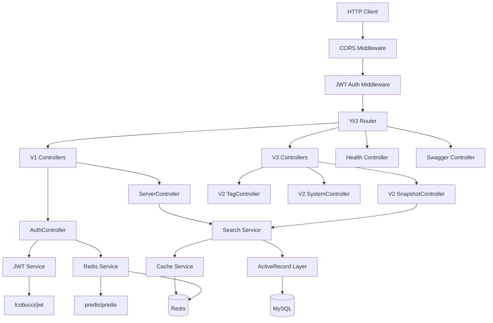
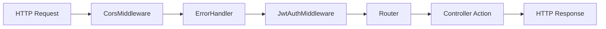

# Design Document: Yii2 到 Yii3 REST API 迁移

## Overview

本设计文档描述将 mrpp-api 从 Yii2 迁移到 Yii3 的技术方案。Yii3 与 Yii2 架构差异巨大：Yii3 采用 PSR 标准（PSR-7 HTTP Message, PSR-15 Middleware, PSR-11 Container, PSR-3 Logger）、依赖注入容器、中间件管道架构，不再使用 Yii2 的 monolithic Application 对象。

核心迁移策略：
- 使用 `yiisoft/app-api` 模板作为项目骨架
- 使用 `yiisoft/db` + `yiisoft/active-record` 替代 Yii2 ActiveRecord
- 使用 `yiisoft/router` 替代 Yii2 urlManager
- 使用 PSR-15 中间件替代 Yii2 behaviors（CORS、认证）
- 使用 `yiisoft/di` 容器管理所有服务依赖
- 使用 `lcobucci/jwt` 直接处理 JWT（不再依赖 bizley/jwt 桥接包）
- 使用 `predis/predis` 或 `yiisoft/cache` 处理 Redis 操作

## Architecture

### 整体架构



### 中间件管道



### 目录结构

```
mrpp-api/
├── composer.json
├── Dockerfile
├── docker-compose.yml
├── .env.example
├── public/
│   └── index.php                    # 入口文件
├── config/
│   ├── common/
│   │   ├── di/                      # DI 容器定义
│   │   │   ├── db.php               # 数据库连接
│   │   │   ├── redis.php            # Redis 客户端
│   │   │   ├── jwt.php              # JWT 服务
│   │   │   ├── cache.php            # 缓存服务
│   │   │   └── services.php         # 业务服务
│   │   └── params.php               # 应用参数
│   ├── web/
│   │   ├── di/
│   │   │   └── middleware.php        # 中间件定义
│   │   ├── params.php
│   │   └── routes.php               # 路由定义
│   └── params.php                   # 全局参数
├── src/
│   ├── Controller/
│   │   ├── V1/
│   │   │   ├── AuthController.php
│   │   │   └── ServerController.php
│   │   ├── V2/
│   │   │   ├── SnapshotController.php
│   │   │   ├── TagController.php
│   │   │   └── SystemController.php
│   │   ├── HealthController.php
│   │   └── SwaggerController.php
│   ├── Model/
│   │   ├── User.php
│   │   ├── Verse.php
│   │   ├── Snapshot.php
│   │   ├── Meta.php
│   │   ├── Resource.php
│   │   ├── File.php
│   │   ├── Tags.php
│   │   ├── VerseTags.php
│   │   ├── Property.php
│   │   ├── VerseProperty.php
│   │   ├── Group.php
│   │   ├── GroupUser.php
│   │   ├── GroupVerse.php
│   │   ├── Manager.php
│   │   ├── Code.php
│   │   ├── VerseCode.php
│   │   ├── MetaCode.php
│   │   ├── UserLinked.php
│   │   ├── Watermark.php
│   │   └── Phototype.php
│   ├── Search/
│   │   ├── SnapshotSearch.php
│   │   ├── VerseSearch.php
│   │   ├── TagsSearch.php
│   │   └── GroupSearch.php
│   ├── Service/
│   │   ├── JwtService.php
│   │   ├── RefreshTokenService.php
│   │   ├── AuthService.php
│   │   ├── SnapshotQueryService.php
│   │   └── HealthCheckService.php
│   ├── Middleware/
│   │   ├── CorsMiddleware.php
│   │   └── JwtAuthMiddleware.php
│   └── Policy/
│       └── VersePolicy.php
├── tests/
│   ├── Unit/
│   └── Property/
└── runtime/
    └── logs/
```

## Components and Interfaces

### 1. CorsMiddleware

PSR-15 中间件，替代 Yii2 的 `\yii\filters\Cors` behavior。

```php
namespace App\Middleware;

use Psr\Http\Message\ResponseInterface;
use Psr\Http\Message\ServerRequestInterface;
use Psr\Http\Server\MiddlewareInterface;
use Psr\Http\Server\RequestHandlerInterface;

class CorsMiddleware implements MiddlewareInterface
{
    public function process(
        ServerRequestInterface $request,
        RequestHandlerInterface $handler
    ): ResponseInterface {
        // OPTIONS 预检请求直接返回 200
        // 其他请求添加 CORS 头后继续处理
    }
}
```

### 2. JwtAuthMiddleware

PSR-15 中间件，替代 Yii2 的 `HttpBearerAuth` behavior。支持路由级别的认证控制。

```php
namespace App\Middleware;

use Psr\Http\Server\MiddlewareInterface;

class JwtAuthMiddleware implements MiddlewareInterface
{
    // 需要认证的路由列表
    private array $protectedRoutes = [
        '/v1/server/private',
        '/v1/server/group',
    ];
    
    // 可选认证的路由（有 token 则解析，无 token 也放行）
    private array $optionalAuthRoutes = [];

    public function process(
        ServerRequestInterface $request,
        RequestHandlerInterface $handler
    ): ResponseInterface {
        // 1. 检查当前路由是否需要认证
        // 2. 从 Authorization: Bearer <token> 头提取 token
        // 3. 验证 JWT token
        // 4. 将 user identity 注入 request attribute
        // 5. 无效 token 返回 401
    }
}
```

### 3. JwtService

JWT 令牌生成与验证服务，直接使用 `lcobucci/jwt` v5。

```php
namespace App\Service;

use Lcobucci\JWT\Configuration;
use Lcobucci\JWT\Signer\Hmac\Sha256;
use Lcobucci\JWT\Signer\Key\InMemory;

class JwtService
{
    private Configuration $config;
    private int $ttl = 10800; // 3 小时

    public function __construct(string $keyFilePath) {
        $key = file_get_contents($keyFilePath);
        $this->config = Configuration::forSymmetricSigner(
            new Sha256(),
            InMemory::plainText($key)
        );
    }

    public function generateToken(int $userId): string { /* ... */ }
    public function parseToken(string $token): ?array { /* ... */ }
    public function validateToken(string $token): bool { /* ... */ }
}
```

### 4. RefreshTokenService

管理 RefreshToken 的 Redis 存储，替代 Yii2 的 Redis ActiveRecord。

```php
namespace App\Service;

use Predis\Client as RedisClient;

class RefreshTokenService
{
    private RedisClient $redis;
    private string $prefix = 'refresh_token:';

    public function create(int $userId): string { /* 生成随机 token，存入 Redis */ }
    public function validate(string $token): ?int { /* 验证 token，返回 user_id */ }
    public function delete(string $token): void { /* 删除 token */ }
    public function deleteByUserId(int $userId): void { /* 删除用户所有 token */ }
}
```

### 5. AuthService

认证业务逻辑编排服务。

```php
namespace App\Service;

class AuthService
{
    public function __construct(
        private JwtService $jwtService,
        private RefreshTokenService $refreshTokenService,
    ) {}

    public function login(string $username, string $password): array { /* ... */ }
    public function refresh(string $refreshToken): array { /* ... */ }
    public function keyToToken(string $key): array { /* ... */ }
}
```

### 6. SnapshotQueryService

场景快照查询服务，封装各种查询逻辑和缓存。

```php
namespace App\Service;

class SnapshotQueryService
{
    public function __construct(
        private ConnectionInterface $db,
        private CacheInterface $cache,
    ) {}

    public function findPublic(array $params): PaginatedResult { /* ... */ }
    public function findCheckin(array $params): PaginatedResult { /* ... */ }
    public function findPrivate(int $userId, array $params): PaginatedResult { /* ... */ }
    public function findGroup(int $userId, array $params): PaginatedResult { /* ... */ }
    public function findById(int $id): ?array { /* ... */ }
    public function findByVerseId(int $verseId): ?array { /* ... */ }
    public function findTags(string $type = 'Classify'): array { /* ... */ }
}
```

### 7. HealthCheckService

健康检查服务。

```php
namespace App\Service;

class HealthCheckService
{
    public function check(): HealthResult {
        // 检查 MySQL 连接 + 响应时间
        // 检查 Redis 连接 + 响应时间
        // 返回综合状态
    }
}
```

### 8. Controllers

所有控制器接收 PSR-7 `ServerRequestInterface`，返回 `ResponseInterface`。

```php
// V1 AuthController
namespace App\Controller\V1;

class AuthController
{
    public function login(ServerRequestInterface $request): ResponseInterface { /* ... */ }
    public function refresh(ServerRequestInterface $request): ResponseInterface { /* ... */ }
    public function keyToToken(ServerRequestInterface $request): ResponseInterface { /* ... */ }
}

// V1 ServerController
class ServerController
{
    public function test(): ResponseInterface { /* ... */ }
    public function public(ServerRequestInterface $request): ResponseInterface { /* ... */ }
    public function checkin(ServerRequestInterface $request): ResponseInterface { /* ... */ }
    public function private(ServerRequestInterface $request): ResponseInterface { /* ... */ }
    public function group(ServerRequestInterface $request): ResponseInterface { /* ... */ }
    public function tags(ServerRequestInterface $request): ResponseInterface { /* ... */ }
    public function snapshot(ServerRequestInterface $request): ResponseInterface { /* ... */ }
}
```

### 9. 路由配置

```php
// config/web/routes.php
use Yiisoft\Router\Group;
use Yiisoft\Router\Route;

return [
    // V1 Auth
    Route::post('/v1/auth/login')->action([AuthController::class, 'login']),
    Route::post('/v1/auth/refresh')->action([AuthController::class, 'refresh']),
    Route::post('/v1/auth/key-to-token')->action([AuthController::class, 'keyToToken']),
    
    // V1 Server
    Route::get('/v1/server/test')->action([ServerController::class, 'test']),
    Route::get('/v1/server/public')->action([ServerController::class, 'public']),
    Route::get('/v1/server/checkin')->action([ServerController::class, 'checkin']),
    Route::get('/v1/server/private')
        ->action([ServerController::class, 'private'])
        ->middleware(JwtAuthMiddleware::class),
    Route::get('/v1/server/group')
        ->action([ServerController::class, 'group'])
        ->middleware(JwtAuthMiddleware::class),
    Route::get('/v1/server/tags')->action([ServerController::class, 'tags']),
    Route::get('/v1/server/snapshot')->action([ServerController::class, 'snapshot']),
    
    // V2
    Route::get('/v2/snapshots')->action([V2SnapshotController::class, 'index']),
    Route::get('/v2/snapshots/{id:\d+}')->action([V2SnapshotController::class, 'view']),
    Route::get('/v2/tags')->action([V2TagController::class, 'index']),
    Route::methods(['GET', 'HEAD'], '/v2/system')->action([V2SystemController::class, 'index']),
    
    // Health & Swagger
    Route::get('/health')->action([HealthController::class, 'index']),
    Route::get('/swagger')->action([SwaggerController::class, 'index']),
    Route::get('/swagger/json-schema')->action([SwaggerController::class, 'jsonSchema']),
];
```

## Data Models

### Yii3 ActiveRecord 迁移策略

Yii3 的 ActiveRecord（`yiisoft/active-record`）与 Yii2 的主要差异：

1. **无静态方法**: 不再使用 `Model::find()`, `Model::findOne()` 等静态方法
2. **依赖 ActiveQuery**: 通过 `ActiveRecordFactory` 或直接实例化 `ActiveQuery` 查询
3. **关联定义**: 使用 `hasOne()` / `hasMany()` 但通过 `ActiveQuery` 实例
4. **无 Behavior**: TimestampBehavior 和 BlameableBehavior 需要手动实现（在 `beforeInsert`/`beforeUpdate` 事件或 Service 层处理）
5. **表名定义**: 通过 `getTableName()` 方法

### 核心模型定义

```php
namespace App\Model;

use Yiisoft\ActiveRecord\ActiveRecord;

class User extends ActiveRecord
{
    public function getTableName(): string
    {
        return 'user';
    }

    // 关联
    public function getLinkedKeys(): ActiveQuery { /* hasMany UserLinked */ }
    
    // 密码验证
    public function validatePassword(string $password): bool
    {
        return password_verify($password, $this->get('password_hash'));
    }
}

class Verse extends ActiveRecord
{
    public function getTableName(): string { return 'verse'; }
    
    public function getAuthor(): ActiveQuery { return $this->hasOne(User::class, ['id' => 'author_id']); }
    public function getImage(): ActiveQuery { return $this->hasOne(File::class, ['id' => 'image_id']); }
    public function getMetas(): ActiveQuery { return $this->hasMany(Meta::class, ['verse_id' => 'id']); }  // 通过中间表
    public function getManagers(): ActiveQuery { return $this->hasMany(Manager::class, ['verse_id' => 'id']); }
    public function getVerseCode(): ActiveQuery { return $this->hasOne(VerseCode::class, ['verse_id' => 'id']); }
    public function getProperties(): ActiveQuery { 
        return $this->hasMany(Property::class, ['id' => 'property_id'])
            ->viaTable('verse_property', ['verse_id' => 'id']); 
    }
    public function getTags(): ActiveQuery {
        return $this->hasMany(Tags::class, ['id' => 'tags_id'])
            ->viaTable('verse_tags', ['verse_id' => 'id']);
    }
}

class Snapshot extends ActiveRecord
{
    public function getTableName(): string { return 'snapshot'; }
    
    public function getVerse(): ActiveQuery { return $this->hasOne(Verse::class, ['id' => 'verse_id']); }
    public function getCreatedBy(): ActiveQuery { return $this->hasOne(User::class, ['id' => 'created_by']); }
    
    // extraFields: name, description, image, author_id, author 从 verse 获取
}
```

### 搜索模型

搜索模型不再继承 Model，而是作为纯服务类，接收查询参数并构建 ActiveQuery。

```php
namespace App\Search;

class SnapshotSearch
{
    public function searchPublic(array $params): ActiveQuery { /* ... */ }
    public function searchCheckin(array $params): ActiveQuery { /* ... */ }
    public function searchPrivate(int $userId, array $params): ActiveQuery { /* ... */ }
    public function searchGroup(int $userId, array $params): ActiveQuery { /* ... */ }
    public function applyTagFilter(ActiveQuery $query, string $tagIds): ActiveQuery { /* ... */ }
}
```

### 分页实现

Yii3 没有内置的 REST 分页器。需要自定义分页逻辑，输出与 Yii2 兼容的 X-Pagination 头。

```php
namespace App\Service;

class PaginationService
{
    public function paginate(ActiveQuery $query, int $page, int $pageSize): PaginatedResult
    {
        $totalCount = $query->count();
        $pageCount = (int) ceil($totalCount / $pageSize);
        $items = $query->offset(($page - 1) * $pageSize)->limit($pageSize)->all();
        
        return new PaginatedResult($items, $totalCount, $pageCount, $page, $pageSize);
    }
    
    public function applyHeaders(ResponseInterface $response, PaginatedResult $result): ResponseInterface
    {
        return $response
            ->withHeader('X-Pagination-Current-Page', (string) $result->currentPage)
            ->withHeader('X-Pagination-Page-Count', (string) $result->pageCount)
            ->withHeader('X-Pagination-Per-Page', (string) $result->perPage)
            ->withHeader('X-Pagination-Total-Count', (string) $result->totalCount);
    }
}
```

### 缓存策略

使用 `yiisoft/cache` + Redis 后端，对查询结果缓存 30 秒。

```php
// 在 SnapshotQueryService 中
$cacheKey = 'snapshot_public_' . md5(serialize($params));
$result = $this->cache->getOrSet($cacheKey, function () use ($params) {
    return $this->snapshotSearch->searchPublic($params)->all();
}, 30);
```

### JSON 序列化

为保持与 Yii2 的 `fields()` / `extraFields()` 兼容，每个模型实现 `JsonSerializable` 接口或提供 `toArray()` 方法。

```php
class Snapshot extends ActiveRecord implements \JsonSerializable
{
    public function jsonSerialize(): array
    {
        $data = [
            'id' => $this->get('id'),
            'verse_id' => $this->get('verse_id'),
            'uuid' => $this->get('uuid'),
            'code' => $this->get('code'),
            'data' => $this->get('data'),
            // ...
        ];
        // extraFields from verse
        if ($verse = $this->relation('verse')) {
            $data['name'] = $verse->get('name');
            $data['description'] = $verse->get('description');
            // ...
        }
        return $data;
    }
}
```


## Correctness Properties

*A property is a characteristic or behavior that should hold true across all valid executions of a system — essentially, a formal statement about what the system should do. Properties serve as the bridge between human-readable specifications and machine-verifiable correctness guarantees.*

### Property 1: CORS 响应头完整性

*For any* HTTP 请求（任意 Origin、任意 Method），CORS 中间件处理后的响应应包含 Access-Control-Allow-Origin、Access-Control-Allow-Methods、Access-Control-Allow-Headers 头。

**Validates: Requirements 2.1, 2.2**

### Property 2: 有效凭据登录返回令牌

*For any* 数据库中存在的用户和其正确密码，调用 login 方法应返回包含非空 accessToken 和非空 refreshToken 的结果。

**Validates: Requirements 3.1**

### Property 3: RefreshToken round-trip

*For any* 用户 ID，创建 RefreshToken 后，使用该 token 调用 validate 应返回相同的用户 ID；调用 delete 后，validate 应返回 null。

**Validates: Requirements 3.2, 3.7**

### Property 4: 无效认证返回 401

*For any* 随机生成的无效 JWT token 字符串，通过 JwtAuthMiddleware 访问受保护端点应返回 401 状态码。

**Validates: Requirements 3.3, 3.4, 9.1, 9.2**

### Property 5: Key-to-token 认证

*For any* UserLinked 表中存在的 key，调用 keyToToken 应返回该 key 关联用户的有效 accessToken 和 refreshToken。

**Validates: Requirements 3.5**

### Property 6: JWT HS256 签名不变量

*For any* 由 JwtService 生成的 token，解析后的签名算法应为 HS256，且 token 在有效期内应通过验证。

**Validates: Requirements 3.6**

### Property 7: 场景查询过滤正确性 — public/checkin

*For any* 数据库状态，通过 public 查询返回的所有快照的关联 Verse 应具有 key='public' 的 Property；通过 checkin 查询返回的所有快照的关联 Verse 应具有 key='checkin' 的 Property。

**Validates: Requirements 4.2, 4.3, 5.1, 5.2**

### Property 8: 场景查询过滤正确性 — private

*For any* 已认证用户，通过 private 查询返回的所有快照的 author_id（通过关联 Verse）应等于当前用户 ID。

**Validates: Requirements 4.4, 5.4**

### Property 9: 场景查询过滤正确性 — group

*For any* 已认证用户，通过 group 查询返回的所有快照的关联 Verse 应属于该用户所在的某个 Group。

**Validates: Requirements 4.5, 5.3**

### Property 10: 标签查询类型过滤

*For any* 通过 tags 端点返回的标签，其 type 字段应等于 'Classify'。

**Validates: Requirements 4.6, 5.6**

### Property 11: 分页正确性

*For any* 正整数 pageSize 和数据集，分页后返回的项目数应不超过 pageSize，且 X-Pagination-Total-Count 应等于数据集总数，X-Pagination-Page-Count 应等于 ceil(totalCount / pageSize)。

**Validates: Requirements 4.8, 10.2**

### Property 12: 标签过滤正确性

*For any* 非空的 tag ID 集合，通过标签过滤返回的所有快照的关联 Verse 应至少关联一个指定的 tag ID。

**Validates: Requirements 4.9**

### Property 13: 健康检查状态一致性

*For any* 服务状态组合（MySQL 正常/异常、Redis 正常/异常），健康检查返回 "healthy" 当且仅当所有服务均正常；否则返回 "unhealthy"。

**Validates: Requirements 6.3, 6.4**

### Property 14: User 密码验证 round-trip

*For any* 非空密码字符串，使用 password_hash 生成哈希后，validatePassword 应返回 true；对于任意不同的密码，validatePassword 应返回 false。

**Validates: Requirements 8.1**

### Property 15: Snapshot extraFields 完整性

*For any* 有关联 Verse 的 Snapshot，JSON 序列化后应包含 name, description, image, author_id, author 字段。

**Validates: Requirements 8.4**

### Property 16: Meta 数据升级幂等性

*For any* Meta 记录的 data 字段，执行数据升级逻辑两次应产生与执行一次相同的结果（f(x) = f(f(x))）。

**Validates: Requirements 8.5**

### Property 17: VersePolicy 权限正确性

*For any* 用户和 Verse 组合，当用户是 Verse 的 author 时 canUpdate 和 canDelete 应返回 true；当用户不是 author 时应返回 false。

**Validates: Requirements 9.3**

### Property 18: 错误响应格式一致性

*For any* 错误状态码（4xx, 5xx），API 返回的 JSON 响应体应包含 status 和 message 字段。

**Validates: Requirements 10.3**

### Property 19: 模型序列化字段一致性

*For any* Snapshot 模型实例，JSON 序列化后的顶层字段集合应与 Yii2 版本定义的 fields() 输出一致。

**Validates: Requirements 10.4**

## Error Handling

### HTTP 错误响应

所有错误响应遵循统一格式，与 Yii2 保持一致：

```json
{
    "status": 401,
    "message": "Your request was made with invalid credentials."
}
```

### 错误类型映射

| 场景 | HTTP 状态码 | 处理方式 |
|------|------------|---------|
| JWT Token 缺失/无效/过期 | 401 | JwtAuthMiddleware 拦截 |
| RefreshToken 无效/过期 | 401 | AuthService 抛出异常 |
| 用户名密码错误 | 401 | AuthService 抛出异常 |
| 资源不存在 | 404 | Controller 返回 |
| 请求参数无效 | 400 | Controller 验证 |
| 权限不足 | 403 | VersePolicy 检查 |
| 数据库/Redis 连接失败 | 500 | 全局异常处理器 |

### 全局异常处理

通过 Yii3 的 ErrorHandler 中间件统一处理未捕获异常，确保：
1. 生产环境不暴露堆栈信息
2. 所有异常转换为标准 JSON 错误响应
3. 记录错误日志

```php
// 自定义 ErrorHandler 确保 JSON 格式输出
class ApiErrorHandler
{
    public function handle(\Throwable $e): ResponseInterface
    {
        $statusCode = $this->getStatusCode($e);
        return $this->jsonResponse([
            'status' => $statusCode,
            'message' => $e->getMessage(),
        ], $statusCode);
    }
}
```

## Testing Strategy

### 测试框架

- **单元测试**: PHPUnit 10+
- **属性测试**: PhpQuickCheck（`steos/php-quickcheck`）或 Eris（`giorgiosironi/eris`）
  - 推荐使用 Eris，它是 PHPUnit 的扩展，集成更自然
  - 每个属性测试最少运行 100 次迭代

### 单元测试

单元测试覆盖具体示例和边界情况：

1. **AuthController 端点测试**: 登录成功/失败、刷新成功/失败、key-to-token
2. **CORS OPTIONS 预检请求**: 返回 200 和正确头
3. **健康检查端点**: MySQL/Redis 正常和异常场景
4. **Swagger 端点**: Basic Auth 保护、JSON Schema 生成
5. **时区配置**: Asia/Shanghai
6. **缓存行为**: 30 秒缓存验证

### 属性测试

每个属性测试对应设计文档中的一个 Correctness Property，使用 Eris 库实现。

配置要求：
- 每个测试最少 100 次迭代
- 每个测试用注释标注对应的 Property 编号
- 标注格式: `Feature: yii2-to-yii3-migration, Property {number}: {property_text}`

重点属性测试：
- **Property 3**: RefreshToken round-trip（创建→验证→删除→验证失效）
- **Property 7**: 场景查询过滤正确性（生成随机数据库状态，验证查询结果过滤）
- **Property 11**: 分页正确性（生成随机数据集和 pageSize，验证分页计算）
- **Property 14**: 密码验证 round-trip
- **Property 16**: Meta 数据升级幂等性
- **Property 17**: VersePolicy 权限正确性

### 测试目录结构

```
tests/
├── Unit/
│   ├── Controller/
│   │   ├── V1/
│   │   │   ├── AuthControllerTest.php
│   │   │   └── ServerControllerTest.php
│   │   ├── V2/
│   │   │   ├── SnapshotControllerTest.php
│   │   │   └── SystemControllerTest.php
│   │   ├── HealthControllerTest.php
│   │   └── SwaggerControllerTest.php
│   ├── Middleware/
│   │   ├── CorsMiddlewareTest.php
│   │   └── JwtAuthMiddlewareTest.php
│   ├── Service/
│   │   ├── JwtServiceTest.php
│   │   ├── RefreshTokenServiceTest.php
│   │   ├── AuthServiceTest.php
│   │   ├── PaginationServiceTest.php
│   │   └── HealthCheckServiceTest.php
│   └── Model/
│       ├── UserTest.php
│       └── SnapshotTest.php
├── Property/
│   ├── CorsPropertyTest.php
│   ├── AuthPropertyTest.php
│   ├── RefreshTokenPropertyTest.php
│   ├── SnapshotQueryPropertyTest.php
│   ├── PaginationPropertyTest.php
│   ├── HealthCheckPropertyTest.php
│   ├── PasswordPropertyTest.php
│   ├── MetaUpgradePropertyTest.php
│   ├── VersePolicyPropertyTest.php
│   └── SerializationPropertyTest.php
└── phpunit.xml
```
